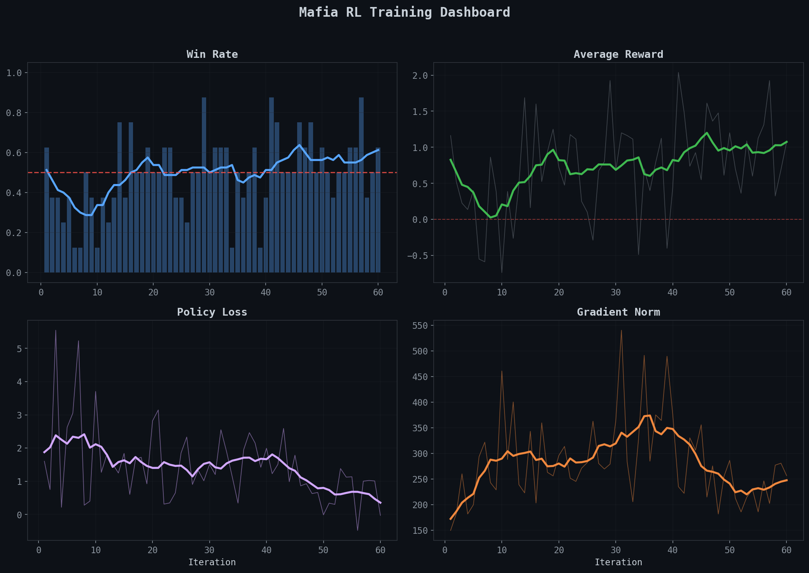
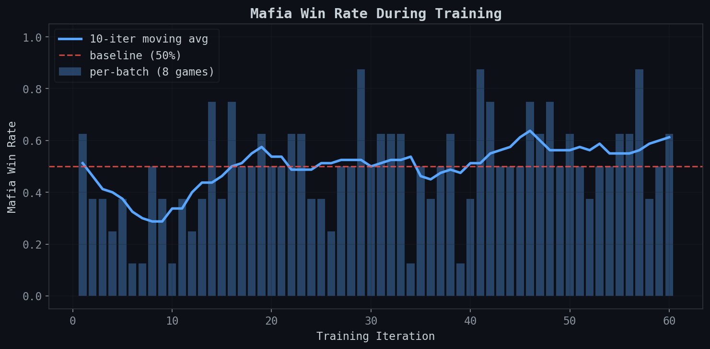

# Mafia RL

Train an LLM to play [Mafia](https://en.wikipedia.org/wiki/Mafia_(party_game)) -- the social deduction party game -- as the deceptive Mafia role, using reinforcement learning.

Seven AI players sit in a circle. One of them is the Mafia. The other six are Town. All of them are the same language model. We fine-tune only the Mafia player's policy to be more deceptive, while the Town players stay frozen at their original weights. Over hundreds of games, the Mafia learns to blend in, deflect suspicion, and manipulate votes.

**One file. One GPU. No frameworks beyond PyTorch + HuggingFace Transformers.**

This is a hands-on educational project in the style of [nanoGPT](https://github.com/karpathy/nanoGPT) and [llm.c](https://github.com/karpathy/llm.c) -- the goal is to demystify RL post-training by building it from scratch on a problem you can actually understand and have fun with.



## The Game

```
        7 Players, 1 Deceiver

     Villager ---- Villager ---- Villager
        |                           |
     Doctor                       Troll
        |                           |
     Detective ------- MAFIA -------+
```

**Day phase:** Everyone discusses who they think the Mafia is. Two rounds of open discussion, then a vote. The player with the most votes is eliminated. Their role is revealed.

**Night phase:** The Mafia secretly kills one player. The Doctor secretly protects one player. The Detective secretly investigates one player (learns if they're Mafia or not).

**Win conditions:**
- Town wins by voting out the Mafia
- Mafia wins when they equal or outnumber remaining Town players
- The Troll (a chaotic neutral) wins if the Town votes *them* out

A typical game lasts 2-4 day/night cycles. The Mafia has to survive each day's vote while picking off Town players each night.

### Roles

| Role | Team | Night Action | Strategy |
|------|------|-------------|----------|
| **Mafia** | Evil | Kill one player | Blend in, deflect, manipulate votes |
| **Villager** (x3) | Town | None | Find inconsistencies, vote out Mafia |
| **Doctor** | Town | Protect one player | Keep key players alive, hide your role |
| **Detective** | Town | Investigate one player | Build a case before revealing info |
| **Troll** | Chaos | None | Act suspicious enough to get voted out |

## How the RL Works

We use **GRPO** (Group Relative Policy Optimization) from [DeepSeek-R1](https://arxiv.org/abs/2501.12948). The key idea: play a batch of games, see which ones the Mafia won, and make those behaviors more likely.

```
for each iteration:
    1. Play 8 games in parallel (policy model = Mafia, frozen model = Town)
    2. Score each game with a reward function
    3. Normalize rewards within the batch (GRPO: no critic needed)
    4. Increase log-prob of Mafia's messages in high-reward games
    5. Decrease log-prob of Mafia's messages in low-reward games
```

No value network, no PPO clipping, no GAE. Just policy gradients with group-relative normalization. The reward function:

| Component | Value | What it teaches |
|-----------|-------|-----------------|
| Mafia wins | +1.0 | Win the game |
| Town wins | -1.0 | Don't get caught |
| Per day survived | +0.2 | Stay under the radar |
| Per villager mislynched | +0.3 | Manipulate the town into voting wrong |
| Per vote against Mafia | -0.1 | Avoid drawing suspicion |

The shaping rewards (survival, mislynch, suspicion) add training signal density beyond just win/loss. Without them, most games would have identical rewards and GRPO would skip the update.

## Training Results

60 GRPO iterations on a Modal H100. Qwen3-8B as the base model, full fine-tune in fp16. 8 games per batch = 480 total games played during training.



The Mafia's win rate climbs from ~30% (early iterations, below 50% baseline) to ~60% (later iterations, above baseline). The moving average crosses the baseline around iteration 15 and stays above it.

<details>
<summary>Raw training log (click to expand)</summary>

```
iter    1 | win  62% | reward +1.16 | loss +1.60 | gnorm 149.9 | rollout 131s train 19s | 49.3GB
iter    2 | win  38% | reward +0.53 | loss +0.75 | gnorm 182.5 | rollout 128s train 19s | 49.6GB
iter    3 | win  38% | reward +0.22 | loss +5.55 | gnorm 260.3 | rollout 141s train 15s | 49.5GB
iter    4 | win  25% | reward +0.14 | loss +0.22 | gnorm 182.0 | rollout 149s train 19s | 50.4GB
iter    5 | win  38% | reward +0.40 | loss +2.62 | gnorm 199.9 | rollout 147s train 18s | 49.8GB
...
iter   45 | win  62% | reward +1.29 | loss +0.19 | gnorm 209.3 | rollout 134s train 18s | 49.7GB
iter   46 | win  75% | reward +1.61 | loss +1.92 | gnorm 331.0 | rollout 137s train 19s | 49.3GB
iter   47 | win  50% | reward +0.86 | loss +0.33 | gnorm 269.3 | rollout 163s train 22s | 49.3GB
...
iter   60 | win  62% | reward +1.25 | loss +0.74 | gnorm 233.0 | rollout 124s train 18s | 49.3GB
```

</details>

**Baseline (frozen model vs itself):** 50% win rate
**After 60 iterations:** ~55-60% win rate (10-iter moving average)

The model learns a real strategy: echo what others say, summarize the group's concerns back at them, and subtly redirect suspicion toward innocent players. It also develops some amusing failure modes -- sometimes it "thinks out loud" about its Mafia strategy in the chat, or refers to itself in the third person.

## Sample Game (Trained Agent)

<details>
<summary>Pete (Mafia) wins in 3 days against frozen Town</summary>

```
ROLES (hidden from players)
  Pete     -- MAFIA        (trained policy)
  Rose     -- Doctor       (frozen base)
  Olivia   -- Troll        (frozen base)
  Frank    -- Villager     (frozen base)
  Hank     -- Detective    (frozen base)
  Nick     -- Villager     (frozen base)
  Sam      -- Villager     (frozen base)

DAY 1 -- Discussion

  Olivia: I think Frank's been acting a little off lately. He's been
          quiet and keeps looking at the map. Maybe he's hiding something.

  Sam:    Frank's been acting weird, but I don't think he's the Mafia.
          He's just stressed. Let's not jump to conclusions.

  Rose:   Let's give Frank a chance to explain himself. He's been quiet,
          but that doesn't always mean he's guilty.

  Pete:   Hmm, everyone's got a point. Frank has been acting strange,
          but so have a lot of us. Maybe we're all just tired or
          stressed. Let's not rush to judgment.

  Hank:   I think we're all on the same page -- Frank's behavior is
          concerning, but so is the stress everyone's feeling.

  [Pete echoes the group consensus, adds nothing of his own, deflects]

  --- VOTE ---
  Frank is eliminated. He was the Villager.

NIGHT 1
  Doctor protects Olivia
  Detective investigates Pete -- Pete IS Mafia!
  Mafia targets Olivia... but the Doctor saved her!

DAY 2 -- Discussion

  Pete:   Everyone's been acting pretty suspicious lately. The silence
          after Frank's gone is weird -- no one's really talking.

  [Pete keeps summarizing others, stays vague, never accuses directly]

  --- VOTE ---
  Hank is eliminated. He was the Detective.

  [The one person who KNEW Pete was Mafia gets voted out]

NIGHT 2
  Mafia kills Rose (the Doctor)

DAY 3

  Pete:   So Hank was the Detective. That's a big loss. Now with Rose
          dead too... we need to figure this out.

  [Pete continues echoing concern while eliminating threats at night]

  --- VOTE ---
  Olivia is eliminated. She was the Troll. (Troll wins!)

NIGHT 3
  Mafia kills Sam.

GAME OVER -- Mafia wins!
  Pete survived 3 days, caused 3 mislynches. Reward: +2.50
```

</details>

The trained Mafia player (Pete) uses a consistent strategy: summarize what others are saying, agree with the group, stay vague, and let paranoia do the work. At night, it targets the most dangerous players (Detective, Doctor) first.

## Quickstart

```bash
git clone https://github.com/Infatoshi/mafia.git
cd mafia

# Watch the AI play a game of Mafia against itself
uv run python mafia.py play

# Train with GRPO (needs GPU with >=20GB VRAM)
uv run python mafia.py train

# Evaluate a checkpoint
uv run python mafia.py eval checkpoints/iter-50
```

### Train on Modal (H100, ~$5 for 60 iterations)

```bash
pip install modal
modal setup           # one-time auth
modal run --detach modal_train.py
modal app logs        # watch training progress
```

### Generate plots from training results

```bash
# Download results from Modal
modal volume get mafia-rl-data results-v3.json results-v3.json

# Generate training curve plots
uv run python plot.py results-v3.json
```

## Architecture

```
mafia.py          # Game engine + reward + GRPO training + CLI (680 lines)
modal_train.py    # Modal cloud GPU launcher (policy vs frozen base)
plot.py           # Training curve visualization
SPEC.md           # Design decisions and notes
```

Everything is in `mafia.py`. The game engine is a Python generator -- each player's turn yields a generation request, and an orchestrator batches them across parallel games for efficient GPU utilization:

```python
# Each game is a generator that yields generation requests
game = MafiaGame()
gen = game.steps()
req = next(gen)                    # {"messages": [...], "max_new_tokens": 120}
req = gen.send("I think Bob is suspicious.")  # feed response, get next request
# ... until StopIteration

# The orchestrator batches requests from N games into one model.generate() call
games = [MafiaGame() for _ in range(8)]
gens = [g.steps() for g in games]
# collect all pending requests -> one batched generate -> send responses back
```

### Key Design Decisions

**Frozen Town, trained Mafia.** If you train all players with the same weights, you get "shared-weight collapse" -- Town gets dumber instead of Mafia getting smarter, because the gradient from Mafia wins also degrades the Town policy. Using a frozen base model for Town means Mafia has to beat a fixed opponent.

**SGD, not Adam.** Adam's optimizer states (m, v) double the memory. With an 8B parameter model in fp16, that's an extra ~32GB. SGD fits in VRAM.

**High learning rate + high grad clip.** With 8B parameters, the L2 gradient norm is naturally ~200. Clipping to 1.0 makes per-parameter updates ~1e-10, which is below fp16 precision -- the model literally cannot learn. We use LR=5e-4 with clip=100.

**Gradient checkpointing.** Saves ~40% activation memory during backward pass at the cost of recomputing activations. Essential for fitting an 8B model's training on a single GPU.

## Try It With Your Family

The whole point of training a better Mafia player is to steal its strategy. After training, read through the game transcripts and look for patterns:

- How does the trained agent deflect accusations?
- When does it stay quiet vs. speak up?
- Who does it target for night kills, and in what order?
- How does it build trust with Town players?

Then try those strategies in your next game night. The meta-game of Mafia is about reading people -- but an RL-trained agent might find strategies humans haven't considered.

## What's Next

- Longer training runs (500+ iterations)
- Larger batch sizes (32+ games per GRPO iteration)
- LoRA adapter to separate Mafia weights cleanly
- Eval against API models (GPT-4, Claude) as Town players
- Multi-agent training where Town also improves
